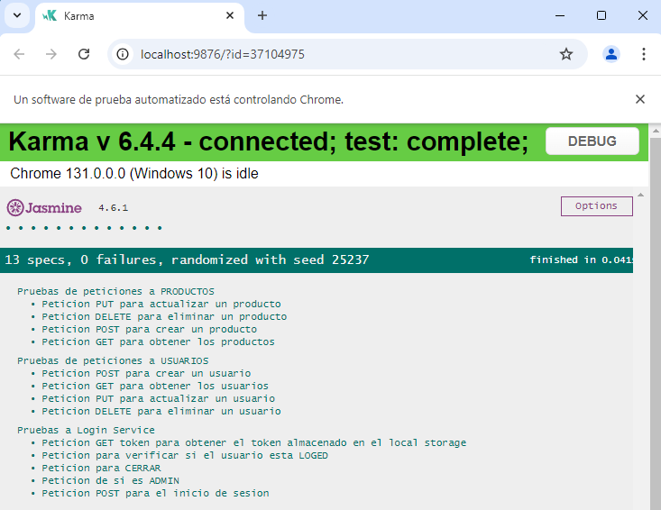

## DESCRIPCION PRUEBAS UNITARIAS EN FRONTEND

Repostorio realizado para realizar pruebas unitarias con Karma y Jasmine para operaciones CRUD de los servicios del Frontend del proyecto final de modulo de 300H

## AUTOR
  Proyecto realizado por Camilo Fetiva para el Bootcamp de Desarrollo Web 2024  
